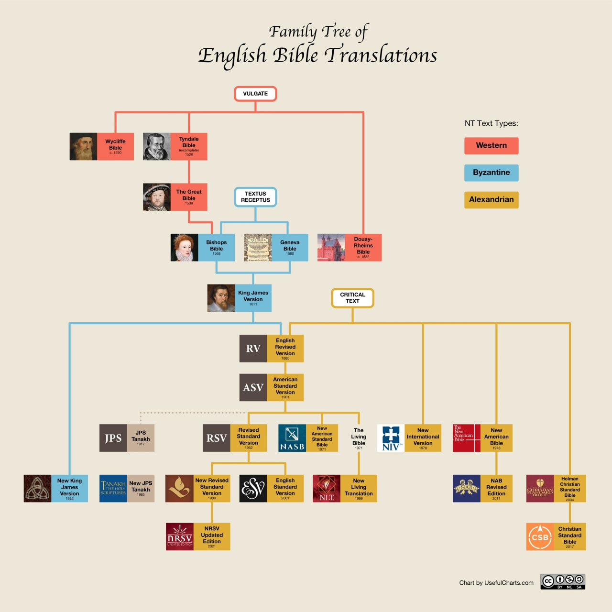

# Bible Translations 

# 

> Haven't you ever wondered why there are so many versions of the bible even within the same language? Let's take a simple look into that...

So the Old Testament in the Bible was written completely in Hebrew with small bits of Aramaic here and there. And the oldest and most complete version of this book is called the Masoretic Text. And almost all the time this is what scholars use to translate the Old Testament. However when translating the New Testament, things become slightly hectic mostly because there are tons of Greek Manuscripts scholars can use.

# These Greek Manuscripts can be grouped into three.
1. **The Western** which were used in early Rome churches. And these manuscripts were used to create the **Vulgate**, which's the latin version of the bible that was used by the Catholic church. (You can see translations that use this in the graph colored red)

2. **The Byzantine** groups of manuscript AKA **the majority texts**. These were used by Eastern early Rome Churches. These documents were later used to create a Greek version of the bible known as Textus Receptus. (You can see translations that use this document in the graph colored blue.)

3. **The Alexandrian** AKA the **neutral texts**. These documents are considered to be the most accurate and reliable even when including documents in recent history, within the last 100 years. These documents form the basis for the **Novum Testamentum Graece** AKA **Nestle Aland**. This greek document is what almost all scholars use to translate the new testament today. (You can see translations that use this in the graph colored yellow)

# Now let's look at early English translations...

The earliest attempt to translate into English was done by a priest called **John Wycliffe** and he used the Latin Vulgate to do so. But he died before he finished and his friends had to finish it for him. (1390) The one drawback of this translation is that it used middle English, which is difficult to read and comprehend.

The first bible that used modern English was the **Tyndale Bible** translated by **William Tyndale** also using the Latin Vulgate. (1526) This action led to his execution and he couldn't finish the translation. Ironically the king (Henry 6th) that ordered William Tyndale's execution for Bible Translation ordered a new Bible Translation after a few years known as **The Great Bible**. And this was used in all churches of England. (1539)

However, The Great Bible was still too expensive for anyone to own. That all changed when Calvinist Protestants decided to translate and publish **The Geneva Bible**. (1560) This Bible is different from all we've seen so far in that it used the Textus Receptus of the Byzantine Manuscripts. And also this is the first bible that uses Chapter and Number division that we still use today. This Bible was mass produced and so this was the first bible that reached the hands of the common man. BUT the publication of The Geneva Bible made the Anglican Bishops at the time unhappy because they thought everyone having their own bible would undermine their powers. So by the grant from Queen Elizabeth 1, they made the **Bishop's Bible**. (1568) So during this period, England was in a weird state where in the churches The Bishop's Bible was read but everywhere else The Geneva Bible was the main book. Then this conflict was then solved by the publication of the most famous and still used translation of the bible called The King James Version. (1611) 

During this time, there were so many manuscripts that were being found which are categorized under the Alexandrian Manuscripts. These collection of Greek Manuscripts were compiled into what's known as the **Critical Texts**. Now translations that based on the critical text are considered to be some of the most accurate bible translations ever. These include the **English Revised Version**, **American Standard Version** and all those that branch from these.

**The Revised Standard Version** you see under the ASV is a very unique bible in the way it was translated. (1962) Tons of Scholars from different christian denominations gathered and worked together to form this book. Catholics, Protestants, Orthodox and so many more worked together into forming this bible version. Sadly this bible version became a bit controversial In the way it translated Isiah 7:14.

The old version said
> "The Lord himself will give you a sign. Behold, a virgin shall conceive and bear a son."

The Hebrew word for virgin is "*almah*". Which translates to a young woman. And so they accurately translated the verse as:

> "The Lord himself will give you a sign. Behold, a young woman shall conceive and bear a son."

Tho this translation was so accurate it made a lot of people unhappy. Now to solve this conflict a new version was made, The **New American Standard Bible**. (1971) This bible version is my personal favorite and it's the bible I use for most of my studies. The reason I do that is because this version is considered to be the most literal translation of the bible. It tries to translate the original texts word for word but adjusted slightly in a way it's readable.

Now, the complete opposite to the NASB is **The Living Bible** translation. This bible is not even a translation, it's a paraphrase. And it's entirely written by 1 person called *Kenneth Taylor*. This book is still significant by making the bible more readable and understandable to so many people and so it is still one of the most loved versions of the bible.

Then the **New International Version** was made. This translation is very profound in a way that it didn't use any previous translation and they all started from scratch using the critical texts. This bible is also clever in a way they translated. They used what's called a *Dynamic Equivalence* translation method. So instead of using Word for Word translation they used phrase for phrase. Now using this same style of translation the **New Living Translation** was made. But this version depended on the Living Bible version that we talked about earlier. They used the same style of translation but tried to be as accurate as possible.

As you can see down in the graph. The **Revised Standard Version** was used for two other versions. The **New Revised Standard Version** and The **English Standard Version**. These two books are very different from eachother. The NRSV is very liberal and is more gender neutral while the ESV is more conservative and is a more literal translation of the bible.

Now there are are a ton more that I won't be getting into which I will leave for you to research on your own. But these are the most popular and fundamental versions.

# Now to Amharic Bible Versions...

Although Christianity became the state religion of Ethiopia in the 4th century, and the Bible was first translated into Ge'ez at about that time, only in the last two centuries have there appeared translations of the Bible into Amharic. The first translation of the Bible into Amharic was by **Abu Rumi** in the early 19th century While travelling through Cairo at about 50/55 years old, Abu Rumi became very ill and was taken in by **M. Jean-Louis Asselin de Cherville**, a French Consul in Cairo He provided Abu Rumi with food, lodging, and medical care. But more significantly, he also provided him with writing materials. 

Over a period of 10 years, Abu Rumi produced a complete translation of the Bible in Amharic before he died of the plague in Cairo. So for me this guy is a bit shady For 10 years, every Tuesday and Saturday, he would be alone with a few people and they would go about translating the bible into Amharic. He told the people around him that he was using an Arabic version of the bible (since Arabic was much more connected to Greek than English) but he never disclosed what Arabic version he used.

But eventually the manuscript containing his translation was purchased by **William Jowett** by £1250 on behalf of the British and Foreign Bible Society. He took it back to Britain where it was typeset and printed. These printed copies were later sent back to Ethiopia with a few adjustments and corrections. A copy of Abu Rumi's translation of the Bible in Amharic was eventually found in a monastery in the early 1860s and launched a church renewal movement that eventually led to the founding of the Ethiopian Evangelical Church Mekane Yesus.

In 1935, **Emperor Haile Selassie 1**, during Italy's invasion of Ethiopia, ordered a translation of a completely new bible. This manuscript was later sent to Britain and printed, but most of the copies were destroyed in a fire during the bombing of London. This translation is also known as the "**Buxton**" translation, because a British missionary named **Alfred Buxton** was instrumental in sending the manuscript from occupied Ethiopia to Britain.

This same basic translation, with some changes, was later printed in the USA, with funds raised by **Rev. Donald Barnhouse**. After it was printed this translation (sometimes referred to as the "**Barnhouse New Testament**") was found to contain a serious error in Rev. 19:10 & 22:9 (an angel commanding John to worship him, rather than prohibiting John to worship him), so most copies were destroyed.

In 1962, a new Amharic translation from Ge'ez was printed, again by the order of the Emperor. This bible is known as the **1955 Amharic Bible** in Ethiopia. And it is the most used bible to this day. This version was said to be done by a council called The Bible Committee the emperor created. At first a 66 books version was released and later on the 81 books version. Under the Bible Society of Ethiopia (a member of the United Bible Societies), a new translation was printed in 1987, translated directly from Hebrew and Greek. A revised version of this appeared in 2005. These versions contain only the 66 books of the Protestant canon, and they have not been widely embraced by the Ethiopian Orthodox Tewahedo Church.

# Then in the years that followed...

> Living Bibles International produced a New Testament. The International Bible Society produced a complete Bible in 2001. This is a translation from the English NIV, or is at least very heavily reliant upon it.

> In 2008, the Watch Tower Society produced an Amharic translation of Jehovah's Witnesses New World Translation of the Holy Scriptures.

> Then for the millennium celebration on the Ethiopian calendar, the Ethiopian Orthodox Church and the Ethiopian Bible Society produced a new translation. This translation differed from recent Amharic translations in that the translators generally followed the Greek Septuagint translation for the Old Testament and the Ge'ez for both the Old and the New. It was warmly welcomed by the Orthodox, but not by Protestants.

# Copyrights and Publishing Licenses 

Now to publish bibles using any of these versions would require licenses and copyrights. To combat this a very interesting version of the bible was made. The **World English Bible**. It is a version that's freely shared online. It is basically the opensource of bible versions. Created by volunteers with oversight by **Michael Paul Johnson**, the WEB is an updated revision of the American Standard Version.

Michael Paul Johnson felt commissioned by God 'to create a new modern English translation of the Holy Bible that would be forever free to use, publish, and distribute.' Since he did not have formal training in this regard, he started to study Greek and Hebrew and how to use scholarly works. His first translated books were the gospel and letters of John, which he shared drafts of on Usenet and a mailing list, receiving some suggestions and incorporating them. Estimating he would be 150 years old by the time this style of work would be finished, Johnson prayed for guidance. The answer was to use the American Standard Version (ASV) of 1901 because it is regarded as an accurate and reliable translation that is fully in the public domain.

Johnson's main goal became modernizing the language of ASV, and he made custom computer programs to organize the process. This resulted in an initial draft that 'was not quite modern English, in that it still lacked quotation marks and still had some word ordering that sounded more like Elizabethan English or maybe Yoda than modern English.' This draft was soon named World English Bible (WEB), since Johnson intended it for any English speaker, and the acronym indicates that the Web is the means of distribution. Over the years, a number of volunteers assisted Johnson. The entire translation effort was deemed complete in 2020, and the only subsequent changes have been fixing a few typos.

As you can see you have to choose what bible version is best for different occasions. And when you're having bible studies it's best to read multiple bible versions at the same time to cross reference and get the bigger picture of the things being said.

# Here are the resources I used to compile this:
* [English Bible Translations Family Tree by Matt Baker](https://youtu.be/Zvre1MNat-8?si=CN-gxiRKl84GiAvQ)
* [Bible translations into Amharic](https://en.m.wikipedia.org/wiki/Bible_translations_into_Amharic)
* [Edward Ullendorff Wikipedia](https://en.m.wikipedia.org/wiki/Edward_Ullendorff)
* [King James Version Wikipedia](https://en.wikipedia.org/wiki/King_James_Version)
* [New American Standard Bible Wikipedia](https://en.wikipedia.org/wiki/New_American_Standard_Bible)
* [Easy-to-Read Version Wikipedia](https://en.wikipedia.org/wiki/Easy-to-Read_Version)
* [Bible Versions and Translations by Bible Study Tools](https://www.biblestudytools.com/bible-versions)

#

# That's it for now. I hope that was helpful and interesting. 😊

