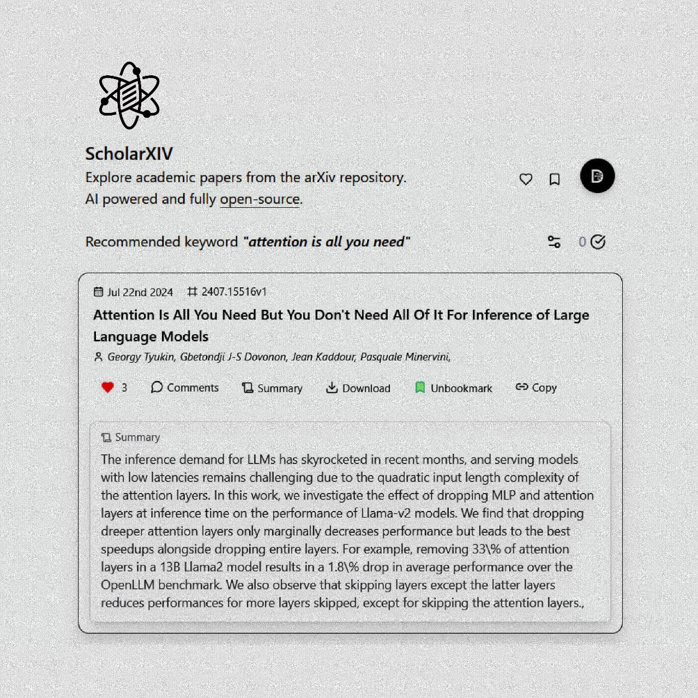
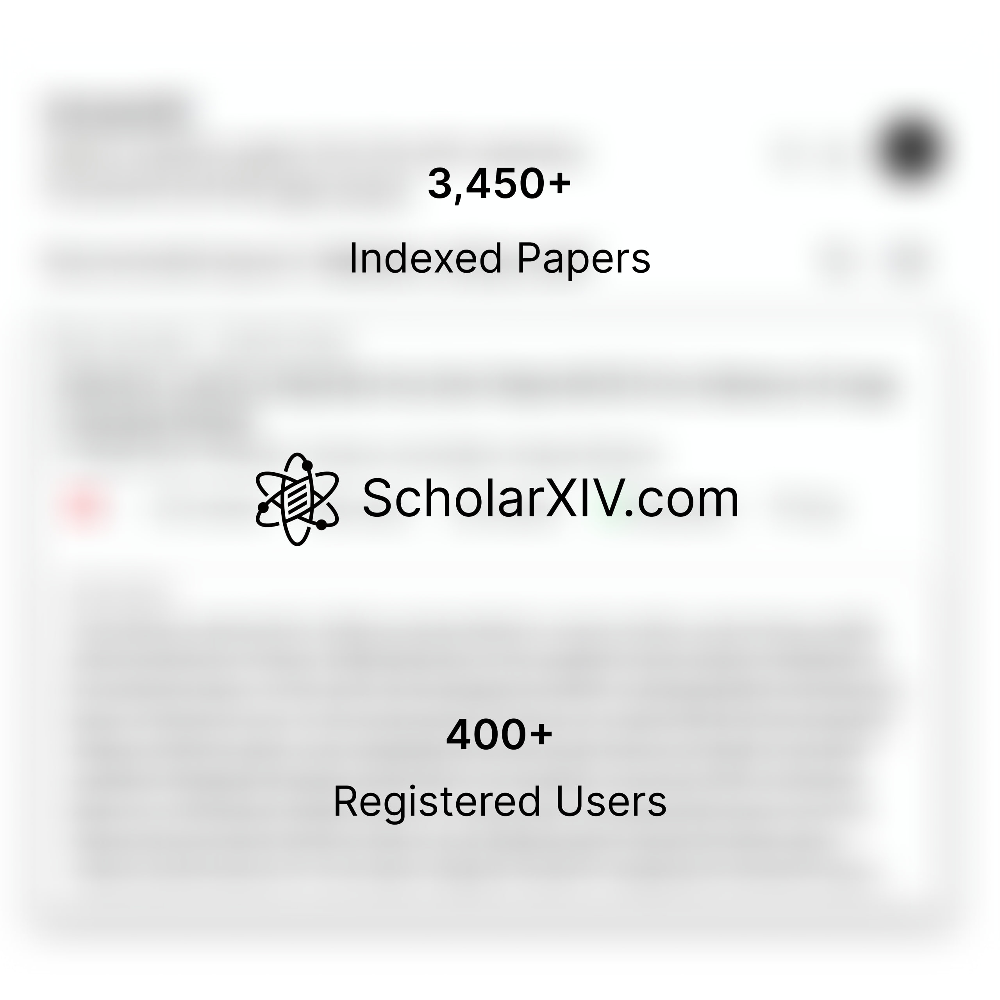

# Where to Launch Your Products

[ScholarXIV](https://scholarxiv.com) is an [open-source](https://github.com/dagmawibabi/scholarxivweb) and AI powered research paper exploration platform I built and recently launched. While announcing ScholarXIV I was keeping notes of all the places I've been sharing it and keeping an eye on the responses in order to give an insight and a bit of a checklist when you decide to launch someday.

Before we proceed I'm going to assume that before you've launched, you've done some alpha and beta testing and that the product is functioning as stable as expected. Another is to have a complete repository if the project is open-source. Andby complete what I mean is that you've decided on the License, Code of Conduct and the project has a very descriptive and nice looking ReadMe. It is after this that you should start launching.

# So let's get to it...

The first place you'd like to launch is on the platform your local dev community uses most. For me it was Telegram. So post on your personal channel on Telegram. This is the best starting place before your product can get elsewhere and ruin your launch campaign with some silly bugs. It's so much better to launch it locally and then get feedbacks and fix things up. After your personal channel, post it on your local developer community, which in Ethiopia is [@CodeNight](https://t.me/CodeNight). This's very useful and important and I've always done it this way, and so did countless others in the community.

Next place to post is on Twitter. This's where most tech projects launch and also go viral and most importantly reach foreign markets and targets. That's why you gotta post on your local community first to reach local devs and fix scaling issues before getting it really out there.

On Twitter, avoid Sunday posts but I did it on Sunday and still got traction but post on weekdays to maximize your chances. Start with an announcement post using the typical twitter format which goes something along the lines of "Announcing..." with a good description and feature list including important links and I can't stress this enough but include a media. Could be a screenshot, demo video or announcement video.

After the announcement post, start posting multiple things a few hours apart to keep the momentum up, some of which should be a post tagging the tools you used to build the product. This definitely helps with traction as these companies often retweet or like it. Also, don't forget to engage with every comment you get.

After Telegram & Twitter, post on Reddit. Specifically on [r/SideProjects](https://www.reddit.com/r/SideProjects/) and [r/FOSS](https://www.reddit.com/r/FOSS/) and if you're launching on a Saturday post on [r/WebDev](https://www.reddit.com/r/WebDev/). These subreddits have such a good attention span. They literally go through and read your readme files, and point out the most niche issues like typos and stuff, which's wonderful to polish things up even more.

Then, you can post on LinkedIn. This really helps with traction, and there's actual value there that'd help out. For example people will write blogs about you, offer marketing, ask you for a podcast session and potential angel investors are there too.

# Finally you're all set for a proper launch...

Product Hunt and HackerNews both of which you can do simultaneously. One important thing to do is that on Product Hunt they disable veiwing how many upvotes you got in the first 4 hours on their homepage, and often times the rank you get within those 4 hours stick for the whole day, so work the most to get the most upvotes on those 4 hours by sharing links. One useful thing to do for your Product Hunt page is to add their banner on your sites that urge every visitor to upvote it. Upvotes on Product Hunt translates to actual marketing and actual users. They also have a mailing list that reaches so many people so getting on the top ranks is very valuable.

After Product Hunt is when you should post on HackerNews and go trending hopefully. Getting lots of upvotes on HackerNews is pretty epic and often times translates to GitHub stars as most are devs there. There's really no hack to HackerNews, just keep it simple and hope it gets picked up.

# Waitlists and Newsletters...

My idea on **wait-lists** are a bit different than most. Ofcourse people sign up on wait-lists to get early access but most of the time if you send your product off to waitlisters you're ruining your product image to them by sending unstable and unscaling versions. Which really sucks cause going back and forth using emails is very undesirable on everyone's side. So I would advice on waiting till it's stable and then emailing them.

Remember the people that actually signed up on your wait-list are the people that properly use their emails, regularly check it and have a bit more effort and care than most. So these people are so valuable for your product, they're the ones that have a bigger potential of being paying users so care for them in sending out your product.

**Newsletters** (email marketing), is also very important. You'd be surprised by how many people would sign up and actually read about the specifics of the product you're launching. So either convert the waitlister to it or have a specific section on your platform to have that. I've seen it do wonderful things for Hungrimind and there's a reason why all product offer this service.

# Graphics

Beautiful Screenshots and Videos of your product are so important, they're crucial infact. So do take your time making very eye catching graphics and informatives about your product. Graphics are what grab the attention of users before your captions on most posts so focus on it.

One good decision I made is to make a demo video and upload it on my YouTube channel as an unlisted video (which allows only people with links to view it) and then linked that video on ScholarXIV and then that video is actually watched more and more by the passing hour.

# During Launch Day...

One very important thing to do on launch day is to keep everyone updates on how the launch is going. This will directly translate to get more traction and attention from people. Keep making nice graphics about stats and announcements and post it.

By now you would have fixed most basic issues and a ton of feedbacks are flowing in and your product is stable for the most part. Now is the time to really take notes on what to improve and fix. Whatever users say, just note it and always think about it.

Finally don't forget to make your GitHub Announcement for the project. Draft a release and launch it. Earlier on this's almost useless but as the stars start coming in is when you should do it. It'll land on the feed of most GitHub users as more people star it.

# After launch days...

These are the days to keep the momentum going for the launch. A successful first launch day will result in more busy days ahead but a successful launch is not day but a week. Consider the first week as a launch week and everyday keep the momentum going.

One important thing to do is write very helpful and valuable blogs just like this one. It is more valuable to the readers but it is also very crucial for you as a founder to have a great reflection on your journey and testifies to your ability to lead the product or company.

# Finaly thoughs...

So overall this's how I've been navigating ScholarXIV's launch and it's going pretty well. Gotten investment offers which I'll announce in the coming days and many more amazing things.

The important thing to note is that you should keep polishing, improving and building out the product as best as you can to deliver a very convincing experience. Remember most of the time things might not go viral, but you can keep launching again and again, posting again and again with every new impressive version of your product.

Good luck!!!
